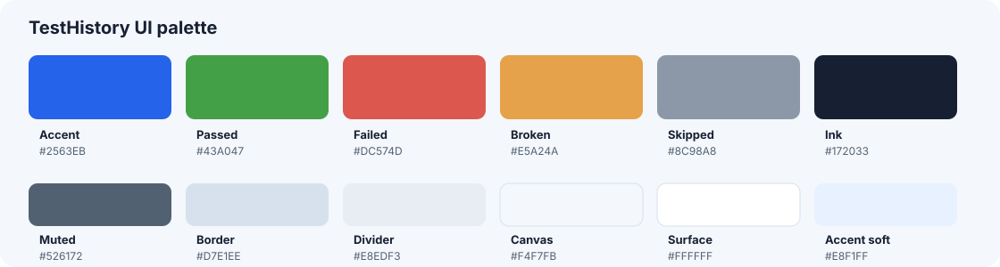

# TestHistory Design Book

Статус: **канонический UI-контракт**

Версия: **1.0**

Контрольный viewport: **1440 × 1000**
Дополнительная ручная проверка: **1280 × 720**

Этот документ — главный источник правил для интерфейса TestHistory. Если старые документы,
скриншоты или существующий CSS противоречат ему, применяется этот дизайн-бук. Исторический
контекст остаётся в `docs/ui-reference.md`, `docs/ui-design-audit.md` и
`docs/design-system.md`, но новые решения должны ссылаться на этот файл.

## 1. Характер продукта

TestHistory — плотный рабочий инструмент для QA, разработчиков и DevOps. Интерфейс должен быстро
отвечать на четыре вопроса:

1. Что произошло?
2. Насколько это серьёзно?
3. Где находятся подтверждающие данные?
4. Как перейти к следующему действию?

Визуальный язык: спокойный светлый canvas, белые рабочие поверхности, строгая типографика,
умеренные скругления и семантический цвет только там, где он передаёт состояние или действие.

### Обязательные принципы

- Информация важнее декора.
- Один экран — одна визуальная иерархия, без конкурирующих акцентов.
- Цвет сообщает смысл, а не категорию ради категории.
- Данные не придумываются. Если API не отдаёт поле, блок скрывается или показывает честное empty
  state.
- Пользовательские сценарии переживают refresh и имеют собственный URL/hash.
- Длинные названия, идентификаторы и метаданные не ломают сетку.
- Загрузка не меняет геометрию страницы и не заставляет интерфейс прыгать.
- На одном ряду находится не более двух информационных панелей.
- Нереализованные действия, разделы и показатели не показываются.

## 2. Визуальная палитра



### Базовые цвета

| Токен           | HEX       | Назначение                                                      |
| --------------- | --------- | --------------------------------------------------------------- |
| `accent`        | `#2563EB` | primary action, активная вкладка, выбранный фильтр, focus ring  |
| `accent-strong` | `#1D4ED8` | hover/pressed primary action                                    |
| `accent-soft`   | `#E8F1FF` | выбранная строка, активная навигация, мягкий информационный фон |
| `ink`           | `#172033` | заголовки и основной контрастный текст                          |
| `text`          | `#303642` | основной текст                                                  |
| `muted`         | `#526172` | вторичный текст и метаданные                                    |
| `muted-light`   | `#748094` | подписи колонок и вспомогательные пояснения                     |
| `border`        | `#D7E1EE` | внешние границы панелей и контролов                             |
| `divider`       | `#E8EDF3` | разделители строк и секций                                      |
| `canvas`        | `#F4F7FB` | фон рабочей области                                             |
| `surface`       | `#FFFFFF` | карточки, таблицы, диалоги и панели                             |
| `surface-soft`  | `#F8FAFC` | toolbar, вторичные области, hover                               |

### Семантические статусы

| Статус              | Основной  | Текст     | Мягкий фон |
| ------------------- | --------- | --------- | ---------- |
| Passed / успешно    | `#43A047` | `#23873A` | `#F0FAF2`  |
| Failed / провалено  | `#DC574D` | `#C83B33` | `#FFF5F4`  |
| Broken / сломано    | `#E5A24A` | `#C57420` | `#FFF8EF`  |
| Skipped / пропущено | `#8C98A8` | `#6B7280` | `#F7F9FC`  |
| Danger action       | `#DC2626` | `#B42318` | `#FFF5F5`  |
| Warning / partial   | `#D97706` | `#B45309` | `#FFF7E6`  |

### Правила цвета

- Синий зарезервирован для навигации, focus, ссылок, primary action и выбранного элемента.
- Все невыбранные пресеты фильтров нейтральные и одинаковые. Scope не кодируется цветом.
- Только выбранный preset получает синий фон, белый текст и focus/selection ring.
- Теги и метаданные нейтральные. Они не должны выглядеть как статус или активный фильтр.
- Статусные цвета нельзя менять между экранами.
- Красный не применяется к warning/partial/loading.
- На одной панели допустим один главный цветовой акцент, не считая семантических статусов.
- Цвет никогда не является единственным носителем состояния: рядом нужен текст, иконка или
  доступная подпись.

## 3. Типографика

Основной шрифт — **Inter**. В bundle должны присутствовать кириллический и латинский subsets в
весах `400`, `500`, `600`, `700`. Другие веса запрещены: браузер не должен синтетически размывать
текст.

| Роль                      |   Размер |     Вес | Line-height |
| ------------------------- | -------: | ------: | ----------: |
| Заголовок страницы        | 18–22 px |     700 |         1.2 |
| Заголовок панели          |    16 px |     700 |         1.2 |
| Заголовок строки/entity   | 14–15 px | 600–700 |        1.25 |
| Основной текст            |    14 px | 400–500 |         1.4 |
| Компактная строка таблицы |    13 px | 400–600 |        1.35 |
| Метаданные                |    12 px | 400–600 |        1.35 |
| Caption/заголовок колонки |    11 px | 500–600 |        1.25 |
| KPI/крупный счётчик       | 20–28 px |     700 |           1 |

Правила:

- Не использовать отрицательный `letter-spacing`.
- Текст меньше 11 px запрещён.
- Uppercase допустим только у коротких caption и lifecycle badge.
- Моноширинный шрифт используется только для кода, stack trace, сырого ID и технических ключей.
- Текст кнопок и вкладок не переносится. При дефиците места применяется ellipsis или
  responsive-компоновка.
- Обычный текст и метаданные переносятся по словам; технические значения допускают
  `overflow-wrap: anywhere`.

## 4. Размерная система

### Отступы

Используется шкала `2 / 4 / 6 / 8 / 10 / 12 / 16 / 20 / 24 / 32 px`.

- Внутренний отступ обычной карточки: `16 px`.
- Toolbar и header: `12–16 px` по вертикали, `16–24 px` по горизонтали.
- Между самостоятельными панелями: `16 px`.
- Между строками формы: `12–16 px`.
- Между иконкой и текстом: `6–10 px`.
- Мобильный внешний отступ: `8–12 px`.

Не вводить случайные значения вроде `13`, `17`, `19`, `23 px`, если это не точная геометрия
графика или иконки.

### Скругления и границы

| Элемент                           |        Radius |
| --------------------------------- | ------------: |
| Input, button, компактный control |          6 px |
| Navigation item                   |          7 px |
| Card, list entity, table shell    |       8–10 px |
| Dialog                            |         10 px |
| Semantic pill, avatar, donut      | 999 px / круг |

- Внешняя граница: `1 px solid #D7E1EE`.
- Внутренний divider: `1 px solid #E8EDF3`.
- Вложенные рамки не дублируются. Card-in-card допустим только для самостоятельного повторяемого
  объекта.

### Тени

- По умолчанию панели обходятся без тени или используют `0 1px 2px rgb(15 23 42 / 4%)`.
- Hover/elevated card: максимум `0 5px 14px rgb(15 23 42 / 7%)`.
- Dialog: `0 18px 48px rgb(15 23 42 / 18%)`.
- Тень не заменяет границу и не используется на каждой вложенной секции.

## 5. Layout и адаптивность

### App shell

- Desktop sidebar: `248 px`.
- Рабочая область: `minmax(0, 1fr)` без горизонтального overflow.
- Sidebar скрывается в reference shell при ширине `≤820 px`.
- Страница имеет один основной vertical scroll owner.

### Сетка контента

- Summary/toolbar может занимать всю ширину.
- Информационные панели: максимум две в ряду, одинаковая ширина.
- Если в последнем ряду одна панель, она сохраняет ширину одной колонки и не растягивается без
  причины.
- List/detail на desktop использует явную ширину master-панели и гибкий detail.
- При нехватке ширины сначала сокращаются вторичные данные, затем компоновка становится
  одноколоночной.

### Контрольные ширины

| Диапазон       | Поведение                                                           |
| -------------- | ------------------------------------------------------------------- |
| `≥1440 px`     | Полная desktop-композиция, крупные status cards, две панели в ряду  |
| `1180–1439 px` | Компактнее иконки и gaps, без обрезания подписей                    |
| `900–1179 px`  | Допускается stacking summary и list/detail                          |
| `760–899 px`   | Одна колонка для сложных панелей, горизонтально прокручиваемые tabs |
| `<760 px`      | Мобильные padding, controls минимум 40 px, одна колонка             |

### Переносы и переполнение

- Заголовок сущности: до двух строк в карточном списке; в toolbar — одна строка с ellipsis.
- ID длиннее 12 символов сокращается визуально; полное значение доступно через `title` или detail.
- Метаданные переносятся внутри своей колонки и не выталкивают status/duration.
- Header и строки таблицы обязаны использовать один и тот же `grid-template-columns` или настоящий
  `<table>`.
- Stack trace и raw payload используют внутренний scroll/pre-wrap и не расширяют страницу.
- Для кнопок обязательны `min-width: 0`, ограничение текста и отдельная защита иконки от shrink.

## 6. Иконки и графики

- Библиотека: `lucide-react`.
- Обычная иконка: `16–18 px`.
- Иконка метрики: `20–22 px`.
- Иконка статуса в крупной status card: `28–32 px` на среднем desktop и до `36 px` на широком.
- Иконка должна рендериться сразу в целевом `size`; нельзя увеличивать SVG с `16 px` до `34 px`
  только через CSS.
- Основной stroke: `2`; допустим `2.2` для небольших toolbar actions.
- Иконка без текста обязана иметь `aria-label` и `title`, если действие не очевидно.

### Donut успешности

- Визуальный диаметр: `100 px`.
- Stroke: `10 px`.
- Значение внутри: `20–22 px`, `700`, tabular numbers.
- Минимальный визуальный зазор между текстом и кольцом: `12 px`.
- Значения `0%`, `92.6%`, `100%` проверяются отдельно.
- Donut интерактивен только если переход по сегменту реализован.

## 7. Компонентный контракт

### Page header

- Содержит title/breadcrumb слева и не более одной primary action справа.
- Refresh, delete и другие действия — компактные secondary/danger buttons.
- Header не меняет высоту при загрузке.

### Кнопки

| Вид        | Использование                                                |
| ---------- | ------------------------------------------------------------ |
| Primary    | Главное действие текущего контекста, максимум одно рядом     |
| Secondary  | Refresh, cancel, открыть настройки, вспомогательное действие |
| Danger     | Удаление/необратимое действие, обычно с подтверждением       |
| Ghost/icon | Навигация назад, overflow, сворачивание                      |

- Desktop control height: `28–36 px` по плотности экрана.
- Mobile/touch height: минимум `40 px`.
- Disabled визуально отличается и объясняется tooltip/контекстом.
- Hover не должен сдвигать layout.

### Поля и поиск

- Высота: `36–40 px`.
- Border: `#AEBDCE`–`#CBD5E1`; background white.
- Focus: accent border и ring `0 0 0 3px rgb(37 99 235 / 14%)`.
- Placeholder — пример, а не обязательное текущее значение.
- Ошибка/валидность показываются без появления большой полосы, меняющей layout.

### Preset filters

- Все невыбранные presets имеют одинаковые neutral background, border и text.
- Scope (`global/project/personal`) передаётся tooltip/aria-label или текстом в меню, не цветом.
- Только один выбранный preset имеет синий фон и белый текст.
- Ручное изменение query снимает выбранный preset.
- Ряд presets переносится на следующую строку, если ширины недостаточно.
- Кнопка «Фильтры» визуально secondary и не выглядит выбранным preset.

### Tabs

- Высота строки: `42–44 px`.
- Активное состояние: текст + underline `2 px` accent.
- Count badge нейтральный, если сам count не является статусом.
- На узкой ширине tabs прокручиваются горизонтально и не переносят подпись.

### Cards и панели

- Card применяется для summary, KPI, chart, повторяемой сущности или самостоятельной панели.
- Фактические detail-секции используют заголовок + rows, без декоративных card-in-card.
- Header панели: `50 px`, title `16/700`, divider снизу.
- Парные панели имеют одинаковую высоту. Одиночное empty state не должно создавать огромную
  пустую область, кроме случая выравнивания пары.
- Не более двух панелей в одном ряду.

### Списки сущностей

- Сущности визуально разделяются card border или row divider, но не обоими одновременно без
  необходимости.
- Название и lifecycle state находятся в первой группе.
- Технический ID вторичен и сокращается.
- Metadata оформляется definition-list или нейтральными chips с переносом.
- Status distribution имеет собственную подпись.
- Hover/focus показывает кликабельность всей строки.

### Таблицы

- Header контрастнее обычного muted text.
- Header и body используют идентичные размеры колонок.
- Duration, count и status выравниваются вправо.
- Главная текстовая колонка получает `minmax(0, 1fr)`.
- Техническая колонка удаляется из summary, если она доступна в detail и мешает чтению.
- Большие списки имеют pagination. Базовый набор page size: `5 / 10 / 20 / 50`; конкретный экран
  выбирает минимально полезное значение.

### Status badge и progress

- Badge содержит текст, а не только цветную точку.
- Главный status результата и статусы в компактной истории используют насыщенную семантическую заливку и белый текст. Мягкий фон остаётся для поясняющих callout и вторичных status-меток.
- Базовая высота основного status badge: `28–30 px`, radius `999 px`, текст `13 px / 700`.
- Progress segment показывает число, если сегмент достаточно широк; доступная подпись содержит
  полный статус и count.
- Progress height в списке: `24 px`.
- Порядок статусов в summary: passed, failed, broken, skipped.

### Empty, loading, partial, denied, error

Единая анатомия: иконка (опционально), короткий title, одна поясняющая строка, одно действие при
необходимости.

- Loading indicator размещается overlay/fixed или в заранее зарезервированном месте.
- Loading не вставляет и не удаляет верхнюю плашку, сдвигающую весь экран.
- Partial — amber, error — red, denied — neutral/red по смыслу.
- Empty section без действия не получает кнопку-заглушку.

### Dialog

- Backdrop, header, scrollable body, footer.
- Backdrop: `rgb(15 23 42 / 48%)`, desktop padding `20px`, mobile padding `12px`.
- Surface: `max-height: calc(100vh - 40px)`, `overflow: hidden`; скролл разрешён только body.
- Header и footer отделены border.
- Primary action справа, cancel рядом слева от неё.
- Danger confirmation явно называет удаляемый объект.
- Dialog сохраняет фокус, закрывается Escape и возвращает фокус инициатору.

## 8. Контент и достоверность

- UI-текст русский, кроме raw identifiers, названий интеграций, проектов и тестов.
- Не использовать внутренние маркеры незавершённости и технические термины в production UI.
- Нельзя вычислять или придумывать даты открытия/закрытия, число retries, jobs, участников,
  defects или environment, если backend не предоставил эти данные.
- Название секции обязано соответствовать содержимому. Нельзя называть произвольные metadata
  «тегами».
- Если категория признана ненужной для продукта, она удаляется со всех связанных detail/summary
  поверхностей, а не только из одной карточки.
- Не дублировать одно значение одновременно в header, summary и metadata rail без новой пользы.

## 9. Контракты экранов

### Auth

- Одна центральная поверхность, без sidebar.
- Поля, submit, переключение режима и ошибки имеют стабильную геометрию.
- Пароль никогда не отображается в логах, screenshot fixtures и URL.

### Projects

- Search + список проектов + понятное selected state.
- Метрики проекта компактные; управление доступом не смешивается со статистикой запусков.

### Dashboard

- Summary strip + полезные widgets.
- Не превращать экран в стену одинаковых декоративных карточек.
- Удаление widget подтверждается dialog.

### Launch list

- Search/presets, count, карточный или плотный row-list запусков.
- Название, lifecycle state, компактный ID, честные metadata, branch, status distribution.
- Не показывать выдуманные opened/closed dates, jobs и tags.
- Metadata переносится; progress имеет подпись; вся строка кликабельна.

### Launch overview

- Верхняя full-width summary: donut, passed/total, четыре status cards, factual metrics.
- Затем максимум две равные панели в ряду.
- Участники и retries не показываются без отдельной подтверждённой продуктовой необходимости и
  корректной API-модели.
- Donut и status cards соответствуют разделу «Иконки и графики».

### Launch results и errors

- Searchable master list + resizable detail.
- В compact unresolved summary только `Тест / Время / Статус`.
- Trace, steps, attachments, history и defects находятся в detail, а не перегружают list row.
- Result metadata rail использует компактные прямоугольные chips/definition groups и полностью скрывает секции без значений.
- Detail читается сверху вниз как рабочий документ: suite/path → название теста → статус и длительность → вкладки → содержимое.
- На overview сначала показывается краткая причина ошибки, затем выполняемый сценарий. Полный stack trace по умолчанию свёрнут, раскрывается в том же контексте и имеет собственный scroll.
- История в правом rail компактна: status и дата находятся в одной строке и ведут к соответствующему результату. Название запуска и duration остаются в полной вкладке истории.
- Используем проверенные информационные паттерны Allure, но не показываем отсутствующие в TestHistory сущности и действия.

### Test cases

- Search/filter list + selected case detail.
- Overview, history, attachments, defects и поля имеют собственные routes/tabs.
- История показывает launch, status, duration и дату без смешивания с runtime/jobs.

### Defects

- Master list + detail или ясный empty state.
- Severity/status всегда текст + цвет.
- Linked results/tests ведут к существующему route.

### Analytics

- Summary strip, один-два основных chart/table блока.
- Легенда, оси и фильтры читаются без hover.
- Цвета status совпадают со всеми остальными экранами.

### Project settings

- Settings tabs используют общий header/tab contract.
- Access, tokens, integrations, retention и fields — таблицы/списки, не набор крупных карточек.
- Редактирование через явное действие и dialog.
- Sensitive values редактируются/копируются безопасно и не попадают в screenshot fixtures.

## 10. Доступность

- Все интерактивные элементы доступны с клавиатуры.
- `:focus-visible` обязателен и заметнее hover.
- Icon-only action имеет доступное имя.
- Active tab использует `aria-current`, selected preset — `aria-pressed` или эквивалентное состояние.
- Status chart имеет текстовое доступное описание каждого сегмента.
- Контраст обычного текста — не ниже 4.5:1; крупного — не ниже 3:1.
- Ошибка формы связана с полем через `aria-describedby`.
- Не использовать `title` как единственный способ получить критичную информацию.
- `prefers-reduced-motion` отключает необязательные transitions/animations.

## 11. Motion

- Обычный transition: `120–160 ms`.
- Разрешены opacity, background, border-color, box-shadow и transform до `1 px` для hover.
- Запрещены bounce, пружины и крупные перемещения рабочих панелей.
- Loading spinner допустим; layout вокруг него остаётся стабильным.

## 12. Запрещённые паттерны

- Цветные невыбранные presets.
- Более двух информационных панелей в ряду.
- Произвольные font weights и синтетический bold.
- SVG, растянутый CSS из маленького intrinsic size.
- Огромный empty card без причины выравнивания пары.
- Технический ID как главная колонка summary-таблицы.
- Несовпадающие колонки header/body.
- Card-in-card-in-card.
- Плашка загрузки, появление которой двигает весь интерфейс.
- Данные, вычисленные из UUID или названия и показанные как реальные даты/статусы.
- Неактивная кнопка без объяснения.
- Горизонтальный scroll всей страницы из-за одного trace, URL или имени.

## 13. Definition of Done для одного экрана

Это повторно используемый шаблон приёмки, а не список незакрытых задач проекта. Перед передачей
изменённый экран должен удовлетворять всем применимым пунктам:

- [ ] Использует палитру, типографику, spacing и radius из книги.
- [ ] Не показывает неподтверждённые данные и нереализованные действия.
- [ ] Имеет loading, partial, empty, error/denied состояния по доступной модели.
- [ ] Длинные русские/английские названия, UUID, URL и metadata не ломают layout.
- [ ] Проверен на `1440 × 1000` и `1280 × 720`.
- [ ] Проверен ниже ключевого breakpoint экрана.
- [ ] Нет horizontal page overflow.
- [ ] Hover, focus-visible, active и disabled различимы.
- [ ] URL/hash и refresh сохраняют выбранную сущность/tab.
- [ ] Нет browser console errors.
- [ ] Обновлены тесты и дизайн guard, если контракт изменился.
- [ ] Снята screenshot evidence из synthetic fixtures.

Минимальные команды:

```text
npm run test -w @testhistory/web
npm run lint
npm run build -w @testhistory/web
npm run guard:ui-design
npm run guard:button-overflow
npm run local:check-ui
git diff --check
```

Для полной evidence-проверки:

```text
npm run guard:ui-interactions
npm run screenshots:capture
```

## 14. План параллельной работы субагентов

Единица параллельной работы — не отдельный screenshot, а **эксклюзивный набор файлов**. Два агента
не должны одновременно изменять один CSS/TSX-файл.

| Пакет        | Routes / evidence                          | Эксклюзивные файлы                                                         |
| ------------ | ------------------------------------------ | -------------------------------------------------------------------------- |
| Shell + Auth | `auth-login`, общая навигация              | `styles.css`, `AuthPanel.tsx`, shell-компоненты                            |
| Projects     | `projects`                                 | `ProjectsReferenceScreen.tsx/.css`                                         |
| Dashboard    | `dashboard`, widget dialog                 | `DashboardReference*`                                                      |
| Launches     | launch list/detail/results/history/defects | `LaunchesReference*`, `LaunchesResultReport.tsx`, `LaunchesStatusIcon.tsx` |
| Test cases   | selected case + history/defects            | `TestCaseListReferenceScreen*`, `TestCaseDetailReference*`                 |
| Defects      | `defects`                                  | `DefectsReferenceScreen.tsx/.css`                                          |
| Analytics    | `analytics`                                | `AnalyticsReferenceScreen.tsx/.css`                                        |
| Settings     | все `settings-*` и settings dialogs        | `ProjectSettingsReference*`, settings tab files                            |
| Shared THQL  | presets, menu, filter dialog               | `ThqlSearchPanel.tsx/.css`, saved-filter model/tests                       |

### Порядок запуска

1. Root-agent фиксирует design book и общие токены/guards.
2. Shared THQL и Shell выполняются до экранных агентов либо получают отдельное эксклюзивное окно.
3. Экранные агенты работают параллельно только по непересекающимся наборам файлов.
4. Каждый агент отдаёт screenshot, список изменённых файлов и результаты локальных проверок.
5. Root-agent выполняет интеграционный review, полный test/build/guards и финальный screenshot set.

### Шаблон задания субагенту

```text
Цель: привести <route/screen> к docs/design-book.md.
Эксклюзивная зона файлов: <paths>. Другие файлы не изменять.
Данные: не придумывать отсутствующие поля и действия.
Обязательно проверить: long text, empty/loading/error, 1440x1000, 1280x720, keyboard focus.
Evidence: <manifest screenshot names>.
Проверки: web tests, lint, build, ui-design guard, button-overflow, git diff --check.
В отчёте: результат, изменённые файлы, screenshot, известные ограничения.
```

## 15. Review-приоритет

При конфликте решений используется порядок:

1. Достоверность и безопасность данных.
2. Работоспособность сценария и маршрута.
3. Доступность.
4. Стабильность layout и читаемость.
5. Канонические компоненты и визуальная согласованность.
6. Декоративная полировка.

## 16. Пользовательская типографика

Весь текст продукта относится ровно к одной из четырёх семантических категорий. Локальные
промежуточные размеры не должны менять вычисленный размер текста:

| Категория             | CSS token           | По умолчанию | Применение                                      |
| --------------------- | ------------------- | ------------ | ----------------------------------------------- |
| Заголовок экрана      | `--th-font-title`   | `24px`       | Название запуска, результата, проекта и диалога |
| Заголовок раздела     | `--th-font-heading` | `16px`       | Вкладки, панели, секции, группы и таблицы       |
| Основной текст        | `--th-font-body`    | `14px`       | Строки, кнопки, поля и описания                 |
| Вспомогательный текст | `--th-font-meta`    | `12px`       | Метки, статусы, даты, длительность и пояснения  |

- Пользователь меняет категории независимо в диалоге «Размер текста» из своей карточки.
- Изменение применяется сразу и показывается на типовом живом примере.
- «Отмена» возвращает состояние до открытия; «По умолчанию» восстанавливает четыре канонических
  значения; «Сохранить» записывает профиль отдельно для текущего пользователя.
- Компоненты не вводят пятый визуальный размер: новый текст размечается одной из этих ролей.
